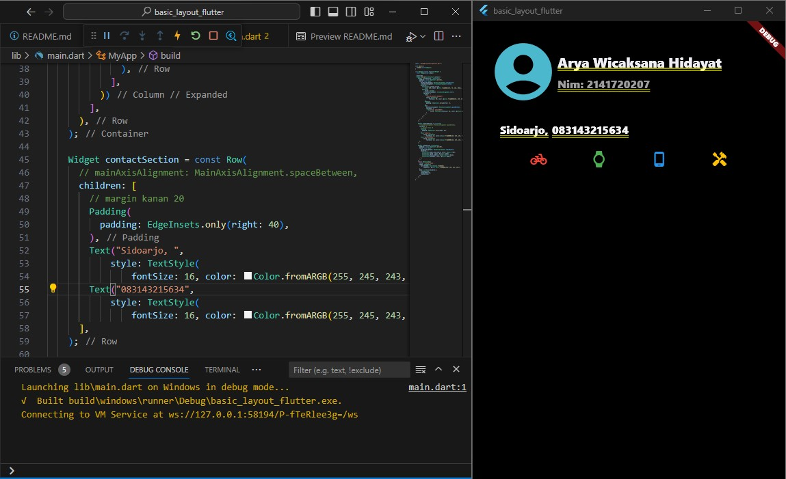
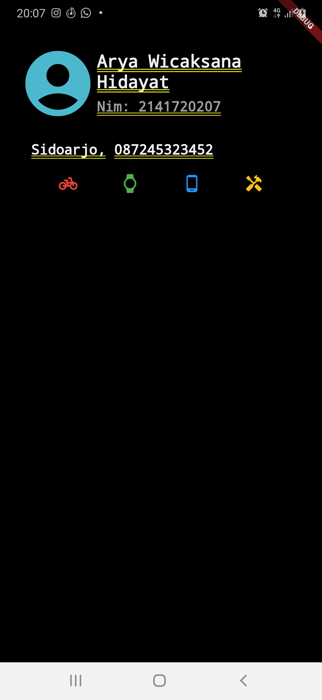

# Tugas Praktikum

1. Selesaikan Praktikum 1 sampai 4, lalu dokumentasikan dan push ke repository Anda berupa screenshot setiap hasil pekerjaan beserta penjelasannya di file README.md!

2. Silakan implementasikan di project baru "basic_layout_flutter" dengan mengakses sumber ini: [https://docs.flutter.dev/codelabs/layout-basics](https://docs.flutter.dev/codelabs/layout-basics)

3. Kumpulkan link commit repository GitHub Anda ke spreadsheet yang telah disediakan!

layout_flutter : [https://github.com/AryaWicaksanaH/07-2141720207-layout_flutter](https://github.com/AryaWicaksanaH/07-2141720207-layout_flutter)